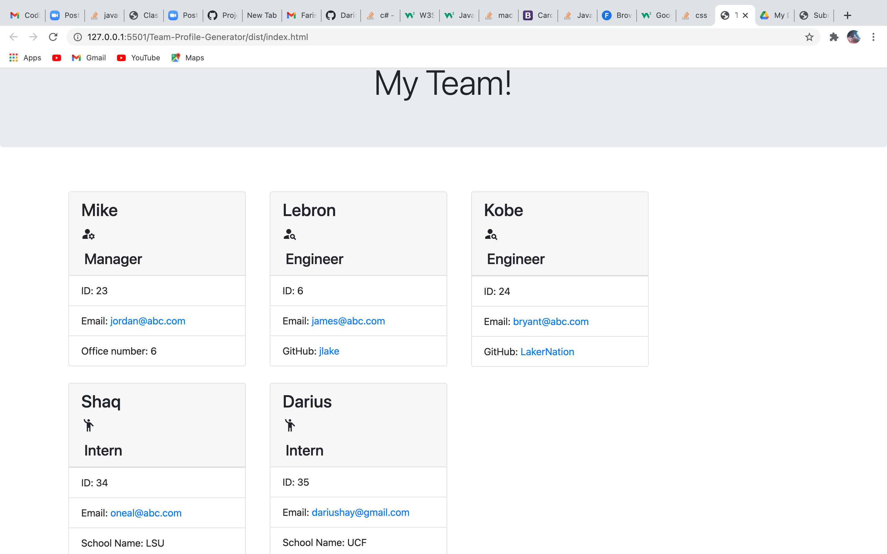

## Project Title

Team Profile Generator

## Description

This is an application that takes user inputs and generates an html page. The user can give their team manager's name, id number, email, and office number and create a card with that information diplayed. The user can enter an engineer's name, id number, email, and github account, and generate a card with that information. Finally, the user can also enter an Intern's name, id number, email, and school name and generate a card displaying that information. The information is generated whent the user chooses to finish building their team. 

## Table of Content

1. [Installation requirements](#Installation)
2. [Screenshots](#Screenshots)
3. [Video of Usage](#Usage)
4. [Contributions](#Contributions)
5. [Questions](#Questions)

## Installation

HTML, JavaScript, "inquirer", "jest", Bootstrap 4.3.1, Google Fonts, and CSS.

## Screenshots

## Usage

https://drive.google.com/file/d/1j--YW9m1fahEnFg4S-XLe0KmSSn3q8CK/view?usp=sharing 

## Contributions

Darius Hay https://github.com/DariusHay

## Questions

If you have any additional questions about this project, you can find me on GitHub at DariusHay https://github.com/DariusHay, or you can email me at dariushay@gmail.com, thank you.