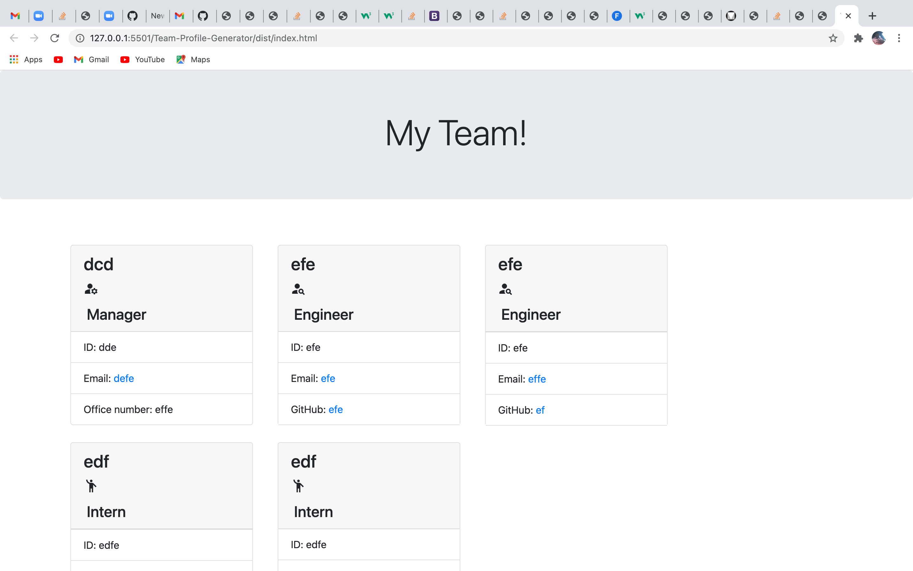

# Team-Profile-Generator

This is an application that takes user inputs and generates an html page. The user can give their team manager's name, id number, email, and office number and create a card with that information diplayed. The user can enter an engineer's name, id number, email, and github account, and generate a card with that information. Finally, the user can also enter an Intern's name, id number, email, and school name and generate a card displaying that information. The information is generated whent the user chooses to finish building their team. 

# Screenshots

